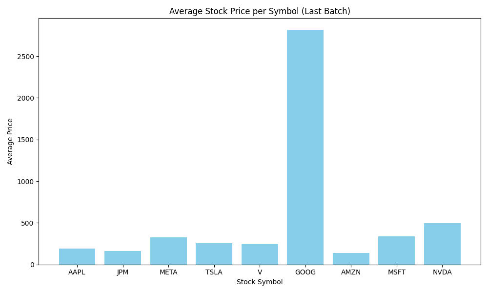
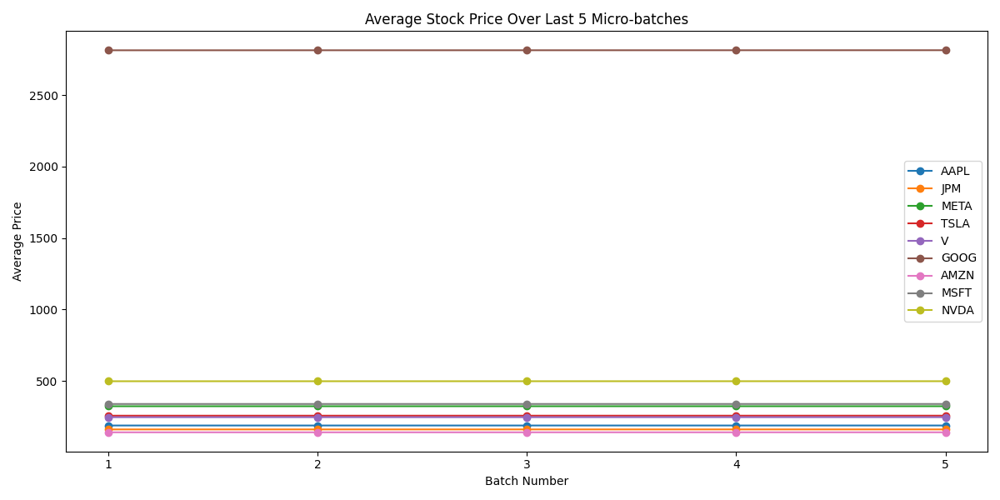

# 💹 **Stock Streaming & Visualization Project**

> Real-time stock data streaming, processing, and visualization using **Kafka**, **Spark**, and **Matplotlib**.

---

## 🧠 **Project Overview**
This project simulates and processes real-time stock data using **Apache Kafka** and **Apache Spark Structured Streaming**, then visualizes results using **Matplotlib**.  
It demonstrates a **complete real-time data pipeline** — from **data ingestion → processing → visualization** — for stock trend analytics.

---

## 📁 **Project Structure**

```
stock_streaming_project/
│
├── data/
│   └── stocks.csv                  # Sample stock dataset (simulation)
│
├── kafka_producer/
│   └── stock_producer.py           # Sends stock data to Kafka topic
│
├── spark_consumer/
│   └── spark_stream_processor.py   # Spark Structured Streaming processor
│
├── output/                         # Processed micro-batches stored by Spark
│
├── visualize_stock.py              # Script for data visualization
├── README.md                       # Project documentation
└── venv/                           # Python virtual environment
```

---

## ⚙️ **System Requirements**

- **Python 3.8+**
- **Apache Kafka 3.9.0**
- **Apache Spark 3.5.2**
- **Hadoop HDFS**
- **Java 17 (OpenJDK recommended)**  
- **Matplotlib**, **pandas**, **pyspark**, **kafka-python**

---

## 🧩 **Environment Setup**

### 🖥️ Java Setup
```bash
export JAVA_HOME=/usr/lib/jvm/java-17-openjdk-amd64
export PATH=$PATH:$JAVA_HOME/bin
```

### 🐍 Python Virtual Environment
```bash
python3 -m venv spark-venv
source spark-venv/bin/activate
```

Install dependencies:
```bash
pip install pyspark kafka-python matplotlib pandas
```

---

## ⚡ **Kafka & Zookeeper Setup**

### 1️⃣ Start Zookeeper
```bash
cd ~/kafka_2.13-3.9.0
bin/zookeeper-server-start.sh config/zookeeper.properties
```

### 2️⃣ Start Kafka Broker
```bash
bin/kafka-server-start.sh config/server.properties
```

### 3️⃣ Create Kafka Topic
```bash
bin/kafka-topics.sh --create --topic stockTopic --bootstrap-server localhost:9092 --partitions 1 --replication-factor 1
```

### 4️⃣ (Optional) Test Producer Console
```bash
bin/kafka-console-producer.sh --topic stockTopic --bootstrap-server localhost:9092
```

---

## 🧱 **HDFS Setup**

### Start HDFS
```bash
start-dfs.sh
source ~/.bashrc
```

### Create Project Directory in HDFS
```bash
hdfs dfs -mkdir -p /user/yukesh/stock_streaming_project/output
```

### Verify Directories
```bash
hdfs dfs -ls /user/yukesh/stock_streaming_project/
hdfs dfs -ls /user/yukesh/stock_streaming_project/output
```

### Upload Dataset to HDFS
```bash
hdfs dfs -put ./data/stocks.csv /user/yukesh/stock_streaming_project/data/
```

### View Processed Output Files
```bash
hdfs dfs -cat /user/yukesh/stock_streaming_project/output/part-00000-*.csv
```

---

## 🚀 **Running the Spark Streaming Processor**

Run the Spark Structured Streaming consumer:
```bash
spark-submit   --master local[*]   --packages org.apache.spark:spark-sql-kafka-0-10_2.12:3.5.2   spark_consumer/spark_stream_processor.py
```

Alternate Spark version:
```bash
spark-submit   --packages org.apache.spark:spark-sql-kafka-0-10_2.12:3.5.0   spark_consumer/spark_stream_processor.py
```

---

## 📊 **Data Visualization**

Activate your environment and run:
```bash
python3 -m venv venv
source venv/bin/activate
python3 visualize_stock.py
```

---

## 🎨 **Visualization Results**

### 1️⃣ Average Stock Price (Last Batch)
Bar chart showing the average price of each stock in the latest micro-batch.  


---

### 2️⃣ Average Stock Price Trend (Last 5 Micro-Batches)
Line graph showing stock price trends across the last 5 micro-batches.  


---

### 3️⃣ HDFS Node Overview
Illustration of the HDFS directory storing processed outputs.  


---

### 4️⃣ Kafka Streaming Setup
Visual representation of Kafka producing live stock data.  


---

## 💡 **Notes & Tips**
- Always ensure **Kafka, Zookeeper, Spark, and HDFS** are running before execution.
- Check HDFS write permissions if Spark fails to output data.
- You can adjust batch duration and topic name in the Spark script for custom testing.

---

## 🧑‍💻 **Author**
**Yukesh Yuki**  
📧 *yukesh2310573@ssn.edu.in*  
💼 [GitHub Profile](https://github.com/Yukesh-30)
